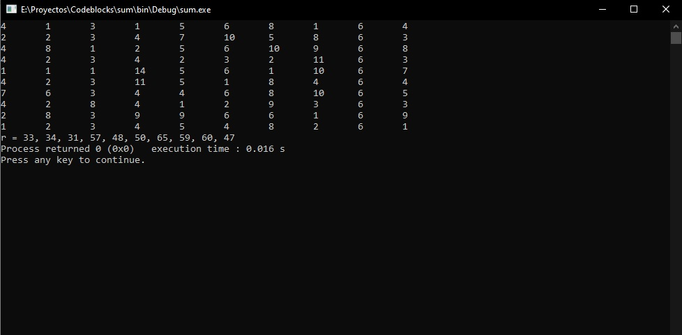

Estudiante: Franklin Canaza

Suma de los elementos de una matriz simple:

                              {{4,  2,  3,  1,  5, 6, 8, 1, 6, 4},

                               {2,  2,  3,  4,  7, 10, 5, 8, 6, 3},

                        {4,  8,  1,  2,  5, 6, 10, 9, 6, 8},
                              
                        {4,  2,  3,  4,  2, 3, 2, 11, 6, 3},
                              
                        {1,  2,  1,  14,  5, 6, 1, 10, 6, 7},
                              
                        {4,  2,  3,  11,  5, 1, 8, 4, 6, 4},
                              
                        {7,  6,  3,  4,  4, 6, 8, 10, 6, 5},
                              
                        {4,  2,  8,  4,  1, 2, 9, 3, 6, 3},
                              
                        {2,  8,  3,  9,  9, 6, 6, 1, 6, 9},
                              
                        {1,  2,  3,  4,  5, 4, 8, 2, 6, 1}}

**Captura de la salida del programa por consola**

