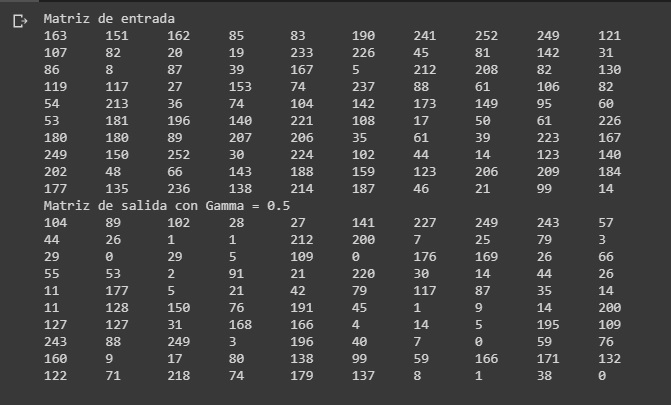

Estudiante: Franklin Canaza Ccori

Calculo de operacion gama a una matriz de 10x10, con un valor gama=0.5

**Captura de la ejecución del programa en colab**

**Link del codigo en colab**

[gama-cuda.ipynb](https://colab.research.google.com/drive/1l4YLtHi6yxuNjq4QRuK9XnQZEIAbMZ10#scrollTo=0oabTT4tvWk6)
