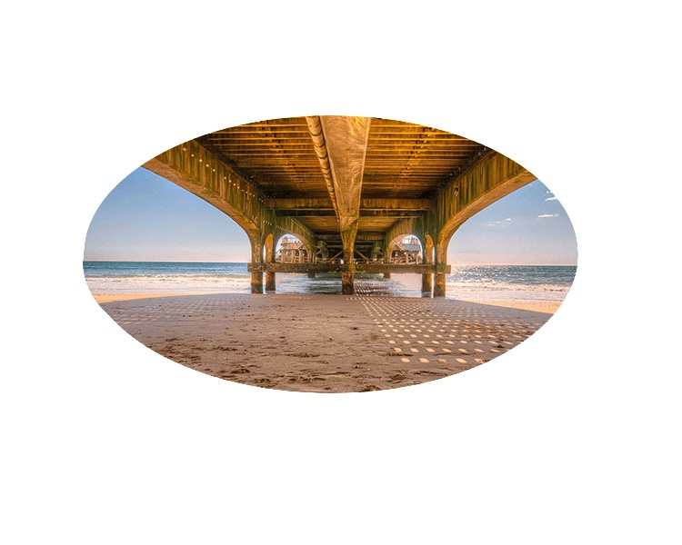
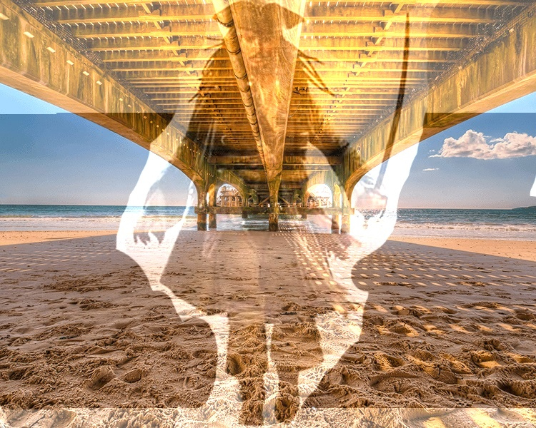
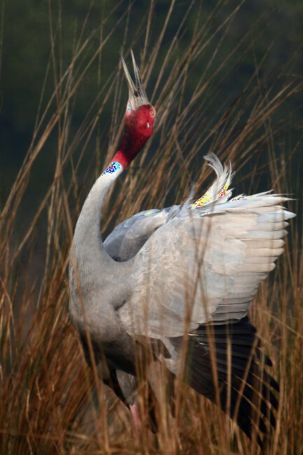
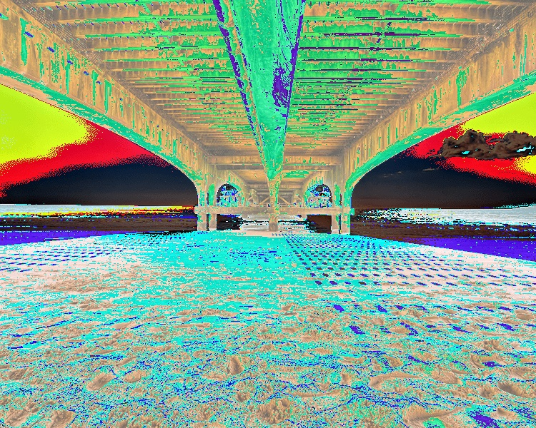
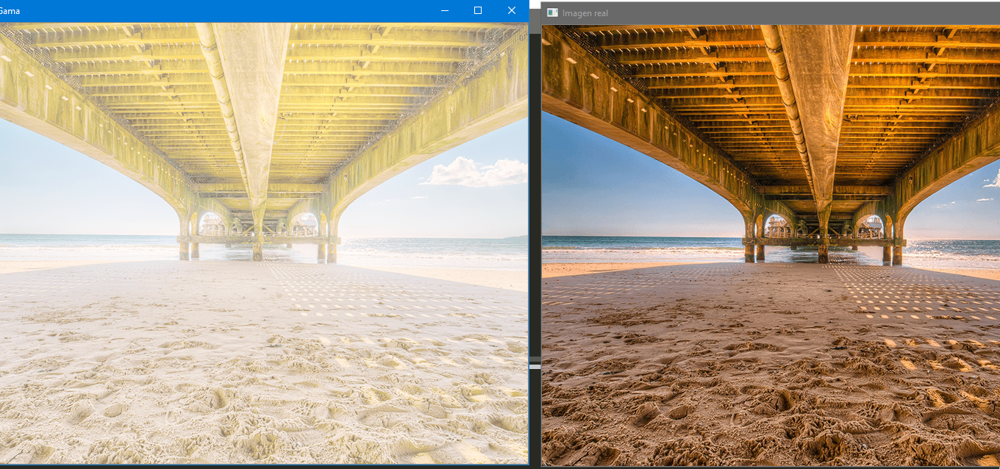
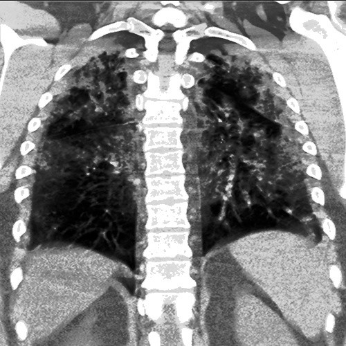

**Suma**

Entre Imagenes
Donde hace es practicamente recorta la imágen y aque si el circulo siguiente es negro(0) más cualquier otro va a permanecer encambio si es blanco(255) entonces se que dara con ese color.

**Suma  Ponderada**

El numero flotante indica que la primera imagen hace que se vea mayor mientras que al poner 0.5 se ve menos.
Al poner el maximo, es decir 0.999 a ambas imágenes aumenta el brillo, ya que se suman las imágenes y al rebasar a 255 es truncado a 255.

**Con un Número**

Cuando se suma aumenta el color rojiso y verde  mientras cuando se resta aumenta el color celeste voliviendo saturado.
La saturación no modifica al color gris de las alas del pato tanto restandole como sumandole dando asi que la saturación no combia con el color gris.

**Transformación Gama**

**Equalización**

Mejora la nitides en imágenes que tiene mucho brillo y a la imágenes que son borrosas tambien lo vuelve nítidas.

