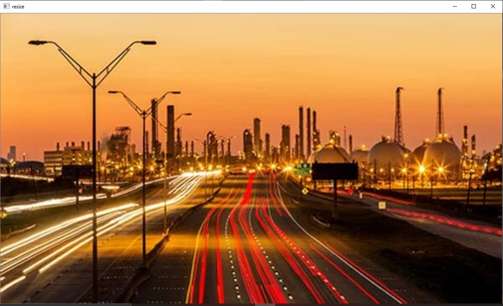
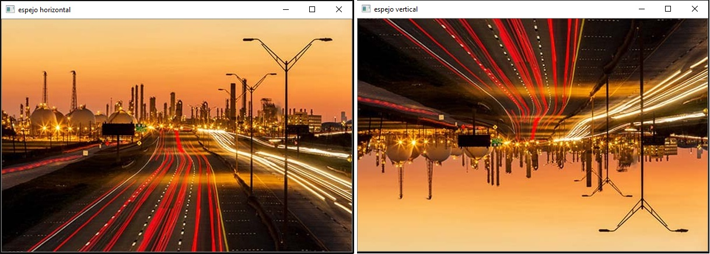
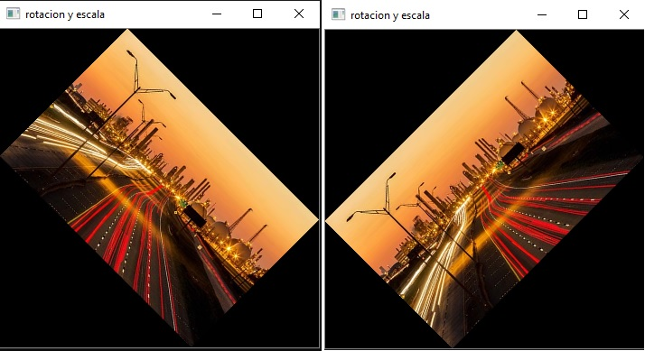
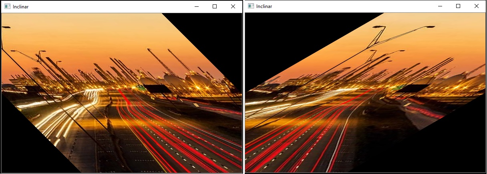

Imagen Original:

**Ejercicio 1: Zoom x2 de una imagen**

**Ejercicio 2: Espejo vertical y horizontal de una imagen**

**Ejercicio 3: Rotar y escalar una imagen**

**Ejercicio 4: Inclinacion de una imagen con 45 grados y -60 grados**

**Ejercicio 5: Transformación a fin a una imagen**

