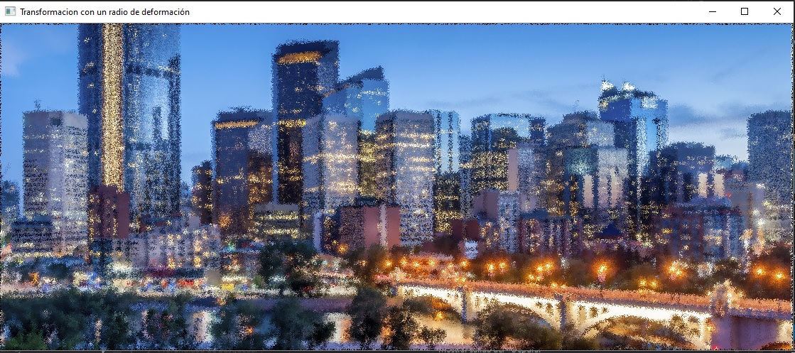
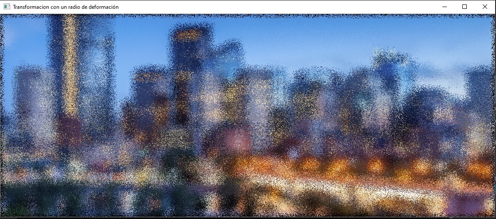
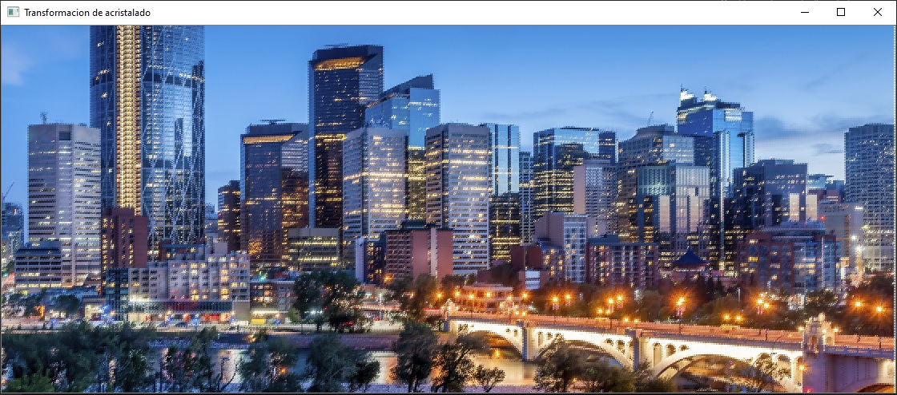
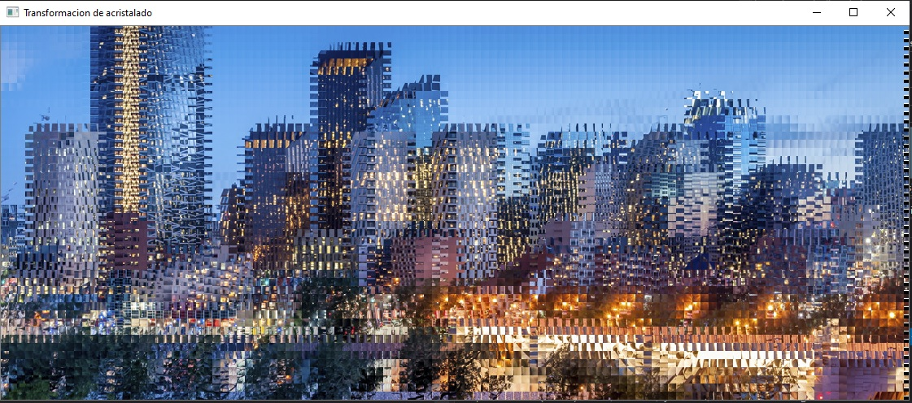

## Practica 4 - Perspectiva y Mapeo

**Imagen original**

**Ejercicio 1: Perspectiva de una imagen**

**Ejercicio 2: Transformación con un radio de deformación, con m=2**

**Ejercicio 2: Transformación con un radio de deformación, con m=10**

**Ejercicio 3: Transformación de acristalado, con m=2**

**Ejercicio 3: Transformación de acristalado, con m=10**

